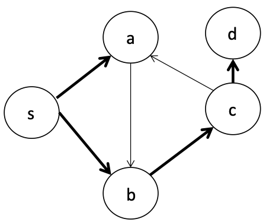

# CMPS 2200 Assignment 5

In this assignment we'll explore graph algorithms.

As with previous assignments, your code implementations will go in `main.py`.
Please add your written answers to `answers.md` which you can convert to a PDF
using `convert.sh`. Alternatively, you may scan and upload written answers
to a file names `answers.pdf`.

## 1. Shortest shortest paths

a) Suppose we are given a a directed, **weighted** graph $G=(V,E)$ with only positive edge weights. For a source vertex $s$, design an algorithm to find the shortest path from $s$ to all other vertices with the fewest number of edges. That is, if there are multiple paths with the same total edge weight, output the one with the fewest number of edges.

Complete the function `shortest_shortest_path` and test with the example graph given in `test_shortest_shortest_path`. Note that the `shortest_shortest_path` function returns both the weight and the number of edges of each shortest path.

.  
.  
.  

b) What is the work and span of your algorithm? 

**Enter answer in `answers.md`**

.  
.  
.  


.  
.  
.  

## 2. Computing paths

a) We have seen how to run breadth-first search while keeping track of the distance of each node to the source. Let's now keep track of the actual shortest path from the source to each node. First, observe that the order in which BFS visits nodes implies a tree over the graph:



Here, the dark edges indicate all the shortest paths discovered by BFS. To keep track of the paths, then, we just need to represent this tree. To do so, we can store a `dict` from a vertex to its parent in the tree. In the above example, this would be:

```python
{'a': 's', 'b': 's', 'c': 'b', 'd': 'c'}
```

Complete the `bfs_path` function to return this parent `dict` and test it with `test_bfs_path`. Your algorithm should not increase the asymptotic work/span of BFS.

b) Next, complete `get_path`, which takes in the parent `dict` and a node, and returns a string indicating the path from the source node to the destination node. Test with `test_get_path`.


## 3. Improving Dijkstra

In our analysis of the work done by Dijkstra's algorithm, we ended up
with a bound of $O(|E|\log |E|)$. Let's take a closer look at how
changing the type of heap used affects this work bound.

a) A $d$-ary heap is a generalization of a binary heap in which we
have a $d$-ary tree as the data structure. The heap and shape
properties are still maintained, but each internal node now has $d$
children (except possibly the rightmost leaf). What is the maximum
depth of a $d$-ary heap?


**Enter answer in `answers.md`**

.  
.  
.  


b) In a binary heap the `delete-min` operation removes the root,
places the rightmost leaf at the root position and restores the heap
property by swapping downward. Similarly the `insert` operation places
the new element as the rightmost leaf and swaps upward to restore the
heap property. What is the work done by
`delete-min` and `insert` operations in a $d$-ary heap? Note that the
work differs for each operation. 


**Enter answer in `answers.md`**

.  
.  
.  


c) Now, suppose we use a $d$-ary heap for Dijkstra's algorithm. What is the
new bound on the work? Your bound will be a function of
$|V|$, $|E|$, and $d$ and will account for the `delete-min` and
`insert` operations separately.


**Enter answer in `answers.md`**

.  
.  
.  


d) Now that we have a characterization of how Dijkstra's algorithm
performs with a $d$-ary heap, let's look at how we might be able to
optimize the choice of $d$ under certain assumptions. Let's suppose
that we have a moderate number of edges, that is  $|E| = |V|^{1+\epsilon}$ for $0<\epsilon
< 1$. What value of $d$ yields an overall running time of $O(|E|)$?


**Enter answer in `answers.md`**

.  
.  
.  


## 4. Spanning trees

a) Consider a variation of the MST problem that instead asks for a tree that minimizes the maximum weight of any edge in the spanning tree. Let's call this the minimum maximum edge tree (MMET). Is a solution to MST guaranteed to be a solution to MMET? Why or why not?


**Enter answer in `answers.md`**

.  
.  
.  


b) Suppose that the optimal solution to MST is impossible to use for some reason. Describe an algorithm to instead find the next best tree (pseudo-code or English is fine). That is, return the tree with the next lowest weight. 


**Enter answer in `answers.md`**

.  
.  
.  


c) What is the work of your algorithm?


**Enter answer in `answers.md`**

.  
.  
.  

